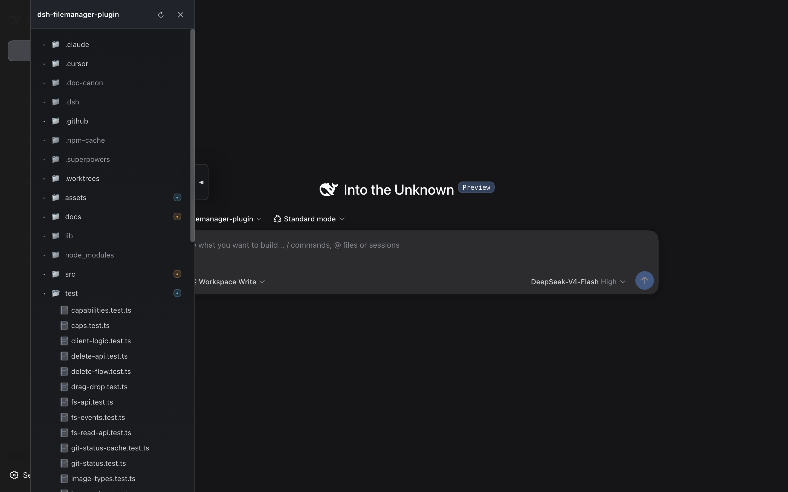
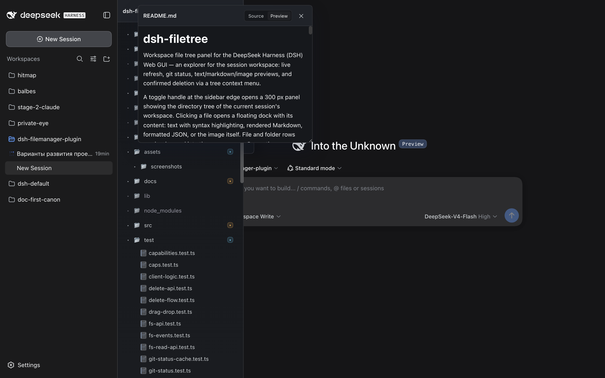
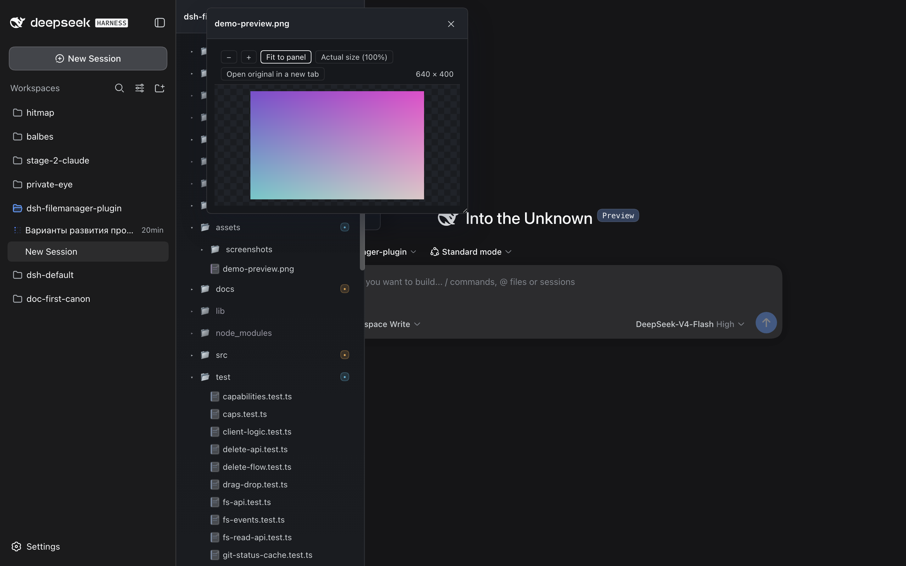
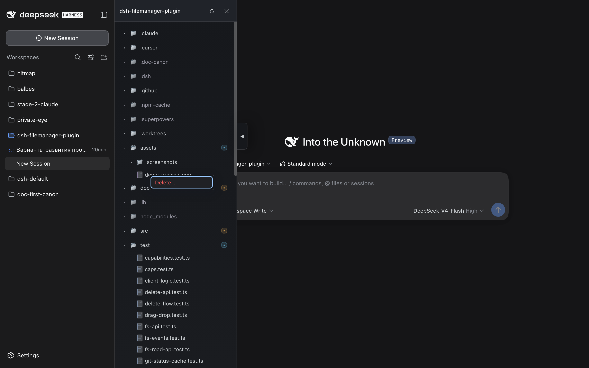

# dsh-filetree

Workspace file tree panel for the DeepSeek Harness (DSH) Web GUI — an explorer for the session workspace: live refresh, git status, text/markdown/image previews, and confirmed deletion via a tree context menu.

[](https://github.com/mdikarev/dsh-filetree/actions/workflows/ci.yml)

A toggle handle at the sidebar edge opens a 300 px panel showing the directory tree of the current session's workspace. Clicking a file opens a floating dock with its content: text with syntax highlighting, rendered Markdown, formatted JSON, or the image itself. File and folder rows can be dragged into the composer as @-mentions.

## Screenshots

<!-- Screenshots live in assets/screenshots/ (referenced relatively, so the
     tarball ships them only when present; files are excluded from the npm
     package via "files": ["lib", "README.md"] — for the README on npm this
     section is intentionally absent until assets are published another way). -->

> **Note for maintainers:** add PNGs under `assets/screenshots/` and they will
> appear here on GitHub (this README is mirrored there). The npm tarball does
> not include `assets/`, so these images render on the GitHub repo page only.

| Panel + tree | Preview dock (Markdown) |
| --- | --- |
|  |  |

| Image preview | Context menu (Delete) |
| --- | --- |
|  |  |

Each row above is one suggested capture from the live GUI (dark or light theme —
the panel adapts via DSH tokens):

1. **tree-panel.png** — the panel open at the sidebar edge with folders expanded
   and git badges visible (a workspace with a few modified/untracked files shows
   the badges best).
2. **preview-markdown.png** — a `.md` file open in the dock in Preview mode.
3. **preview-image.png** — an image file open in the dock (zoom toolbar visible).
4. **context-menu.png** — the row context menu (right-click) with the Delete
   command highlighted. The confirmation dialog that follows is shown in the
   plugin docs and covered by tests; capturing it here requires a server build
   with the delete-info preflight action live.

## Features

- **Tree panel**: lazy directory loading on expand, folders first then case-insensitive alphabet, dotfiles shown (`node_modules` and `.git` filtered), theme-aware styling via DSH tokens (auto dark/light).
- **Git status**: per-file and per-folder badges (modified / added / untracked / ignored) with folder summaries; ignored rows muted.
- **Live refresh**: the tree updates automatically via a fetch-based SSE stream with a polling fallback. A server heartbeat + client watchdog detect a stalled connection and degrade to polling with a status banner instead of freezing silently.
- **Performance**: the workspace git-status snapshot is cached server-side (TTL + event invalidation), so refresh bursts share a single `git status` run.
- **Preview dock**: draggable by its header, resizable, position/size remembered per workspace; text files up to 5 MB (truncation notice); Markdown renders with a Source/Preview toggle — workspace-local relative images render inline, external images stay blocked; syntax highlighting for common languages.
- **Image preview**: raster (png/jpeg/gif/webp/avif) and svg files open fitted to the panel with zoom controls (toolbar buttons, double-click) and image dimensions in the toolbar; "open original" opens the raw file in a new tab; SVG responses are served with a sandbox CSP.
- **JSON view**: Raw/Formatted toggle — Formatted is the default for valid JSON under 1 MB; invalid or oversized files fall back to raw with a note.
- **Composer integration**: drag files/folders from the tree into the composer to insert @-mention references.
- **Truncated names**: hovering a row whose name is clipped shows a themed tooltip with the full name (only when truncated).
- **i18n**: UI copy is localized — English by default, Russian auto-selected for ru-locale browsers (override: `fm-locale` in localStorage).
- **Accessibility**: tree semantics (roles/`aria-expanded`/`aria-level`), full keyboard navigation (arrows, Home/End, Enter/Space, ArrowLeft/Right on folders), the preview is a dialog and closes on Escape, visible focus styles.
- **Context-menu delete**: tree rows get a context menu (right-click or Menu key) with Delete; deletion is confirmed in an inline dialog that warns about uncommitted git changes; files and folders (recursively) can be deleted, symlinks are removed as links; the workspace root and `.git` are protected.

## Scope

The panel is **read-only**, except explicit confirmed deletion of files/folders via the tree's context menu: it browses and previews files and never mutates them otherwise. File operations (create/rename/move) are intentionally out of scope.

## Server API

The plugin registers a `/filemanager-fs` prefix on the DSH host:

- `GET /filemanager-fs/root?hint=<workspace>` — workspace root
- `GET /filemanager-fs/list?hint=<workspace>&path=<rel>` — directory listing with git status
- `GET /filemanager-fs/read?hint=<workspace>&path=<rel>` — text file content (up to 5 MB; `truncated: true` when cut)
- `GET /filemanager-fs/events?hint=<workspace>&paths=<json>` — SSE stream of workspace changes (and `git-changed` events), with a heartbeat
- `GET /filemanager-fs/cap?hint=<workspace>` — mints an unguessable, expiring per-workspace capability token used to authorize image URLs
- `GET /filemanager-fs/raw?hint=<workspace>&path=<rel>&cap=<token>` — serves image bytes to capability URLs (byte caps: 20 MB raster / 2 MB svg; `nosniff`/`no-store`)
- `GET /filemanager-fs/delete-info?hint=<workspace>&path=<rel>` — read-only preflight for deletion: entry kind, whether it is the workspace root, and whether the file (or any descendant of a folder) carries uncommitted git changes (403 path escape / 404 not found)
- `POST /filemanager-fs/delete?hint=<workspace>&path=<rel>` — permanently deletes the file or folder, recursively (header-gated and POST-only); symlinks are removed as links; the workspace root and `.git` are rejected (403/404/409)

All endpoints except `GET /filemanager-fs/raw` require the `x-dsh-filemanager: 1` header. `/raw` is the only endpoint reachable without it — capability URLs must work as plain `` sources and inside the Markdown preview — and authenticates via the token from `/cap`. Paths are contained to the workspace (realpath + escape checks, symlink-safe), and git is invoked read-only.

## Compatibility

- **Node** >= 20 (`engines`).
- **React 18** — provided by the DSH web host, not bundled (peer `^18.2.0`; verified against 18.3.1).
- **DSH**: built and tested against `@deepseek-ai/dsh@0.1.2-rc.1` (web profile). Drag-and-drop into the composer targets the Lexical composer of dsh >= 0.1.2; textarea hosts of earlier dsh versions keep working through the same native text/plain drop. The plugin host and client APIs are pre-1.0 — pin the dsh version you deploy and re-test after dsh upgrades.
- **Trust model**: server endpoints are served by the dsh host on localhost and rely on the `x-dsh-filemanager` header (image bytes additionally require an unguessable, expiring per-workspace capability token) plus the browser's same-origin/CORS behavior — treat the local dsh process as the trust boundary.

## Installation

### From npm

```bash
dsh plugin --profile web add dsh-filetree
```

### From a local checkout (development)

```bash
npm install
npm run build
dsh plugin --profile web add /path/to/dsh-filemanager-plugin
```

Then register the service in the profile patch (`~/.dsh/profiles/web/cordis.patch.yml`):

```yaml
- insert:
    - id: filemanager
      name: 'dsh-filetree'
```

Restart `dsh web` and refresh the browser.

## Development

```bash
npm run build      # esbuild: host (lib/index.js) + client bundle (lib/client.js)
npm test           # node:test + tsx
npm run typecheck  # tsc --noEmit
npm pack           # builds lib/ first (prepack) — inspect the publish tarball
```

CI (`.github/workflows/ci.yml`) runs typecheck, tests and the build on every push/PR.

## Documentation

- Behavioral source of truth lives in `docs/canon/` (doc-canon).
- The maturity roadmap and per-phase specs/plans live under `docs/superpowers/`.
- `CHANGELOG.md` follows Keep a Changelog; releases are tagged `vX.Y.Z` — see [RELEASING.md](RELEASING.md) for the release runbook.

## License

MIT — see [LICENSE](LICENSE).
